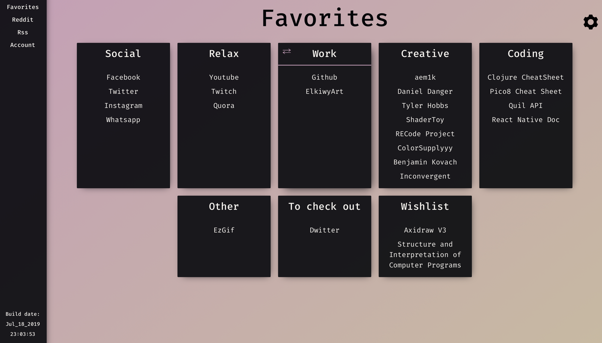
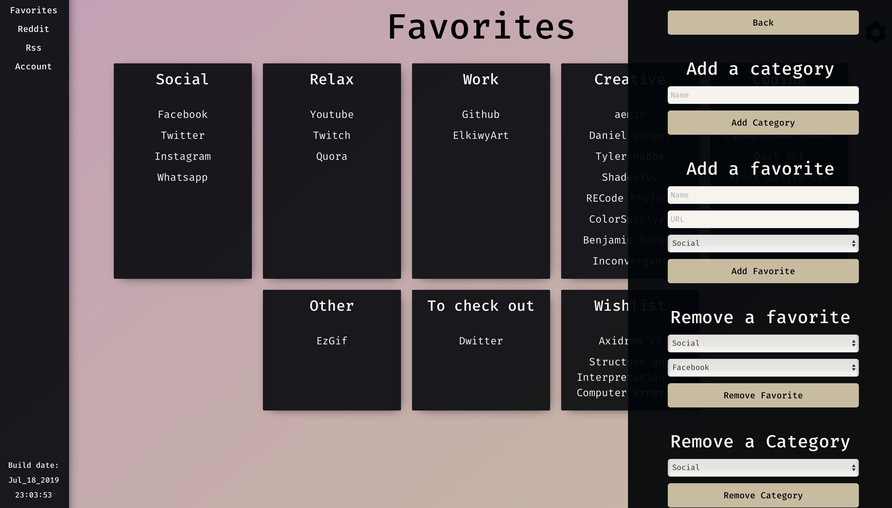
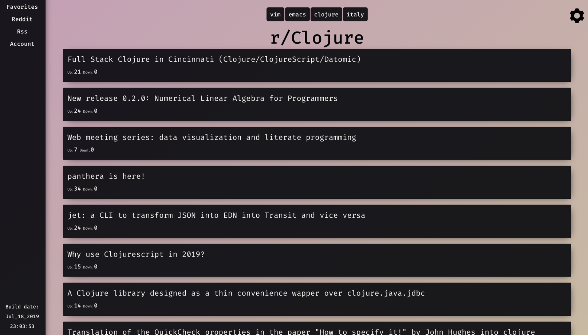

# What is homepage-cljs?
This is a simple project I made to learn `Clojurescript` and `React`.
  
The main concept is to be a homepage where I can store and access easily all my bookmarks, browse quickly some subreddits, read rss feeds, and use other utilities that I'll add in later stages when I find something that could be useful to have in a homepage like this.
  
*Homepage-cljs* can optionally store the user's data on a backend server (temporary hosted on a sub-domain of my website), so the user can access to its homepage between different computers and devices (I'm already working on a mobile client for it called homepage-native with Clojurescript and React native).
  
The project started as a personal one, but then I decided to let it available to everyone here on GitHub so anyone can give me feedback, study it to learn Clojurescript and React, or simply enjoy it using it as a homepage.
  
## What's already in it
Currently the project has 4 different sections:
- The favorites page, where you can add bookmarks organized in separate sections and have them all displayed nicely in front of you.
- The reddit page, where you can add your favorites subreddits and browse the hottest post in that subreddit in a simple and minimal fashion.
- The rss page, where you can fetch your rss feeds and read them directly in the page.
- The account page, where you can sign/log in to be able to sync your data with the backend.
  
## What's planned 
Here are some of the ideas to be developed in the near future (the list can grow any time):
- A search page with multiple engines to choose from (google, duckduckgo, youtube, stackoverflow, etc...)
- A deadline/reminder page where you can add all your deadlines/appointment and have them all displayed ordered by the time distance from now and have a count down for each reminder
- An improved and extended reddit page where you can read and comment posts
- A custom host for the backend server in order to use your own trusted server to sync your data	 
   
# Instructions
  In order to use and modify the code you need to have [Leinengen](https://leiningen.org)
  installed on your machine.
  
## Build for production
   To get the final build ready to be used you have to download the
   source and call:
   
   ```lein clean && lein package```
   
   *NB:* if you do not need to change the code by yourself you should
   be able to find an updated build inside the `/public` folder.
  
  
## Build for development
I personally use Emacs with the wonderful [Cider](https://github.com/clojure-emacs/cider) package. If you are familiar with Emacs (Or you are willing to learn it) I highly recommend it.
   
### Cider
To start with cider you have to:
- open one of the files inside `/src` inside Emacs
- `M-x cider-jack-in-cljs` to start the REPL
- select `figwheel` as your REPL type
- Then you should be ready to develop
	
### Other
There are many other ways to develop clojure. The simplest of them is:
- Open your favorite text editor and a terminal
- `cd` into the source directory
- `lein figwheel` to start *Figwheel*, this is the tool that will keep track of any changes into the source files and will update the running development build according to those changes. It also should open your browser automatically with a tab to localhost where there will be the development build.
	  
	  
# Backend management
Currently this project offers the chance to sync data with a backend through an account that you can create inside the app. The account creation is totally optional and it only give the user the chance to share the same config between multiple devices and browsers.
  
No email is necessary and the create an account you will only have to give a username and a password, the backend will do all the magic.
  
The data is currently stored inside a db in a subdomain of [elkiwyart.com](https://www.elkiwyart.com) with the password being hashed with the sha256 algorithm.
	
# Screenshots

<center>
  
  
  
</center>
	
	
	
	
	
	
	
	
	
	
	
	
	
	
	
	
	
	
	
	
   

	
	
	
	
	
	
	
	
	
	
	
	
   
